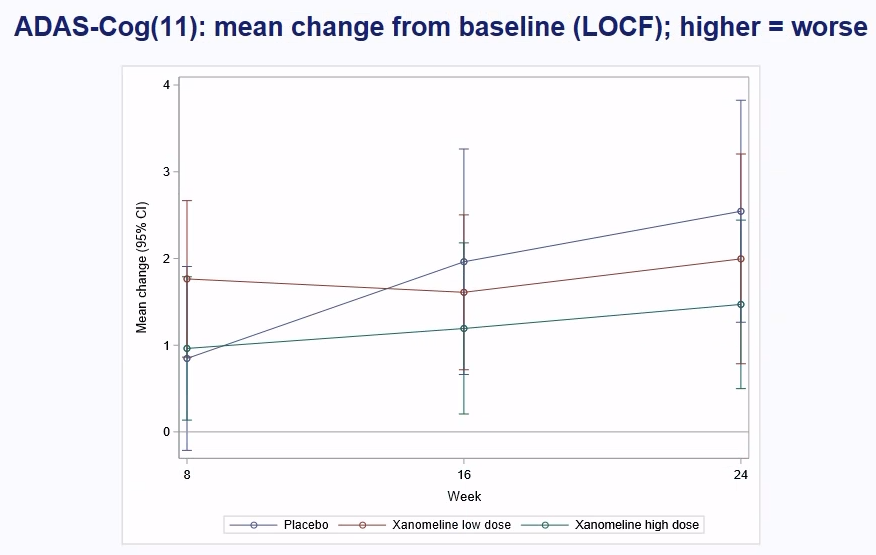
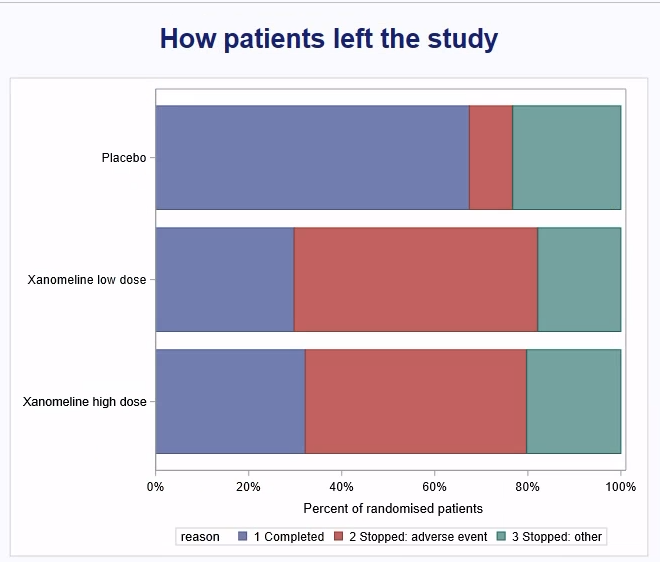
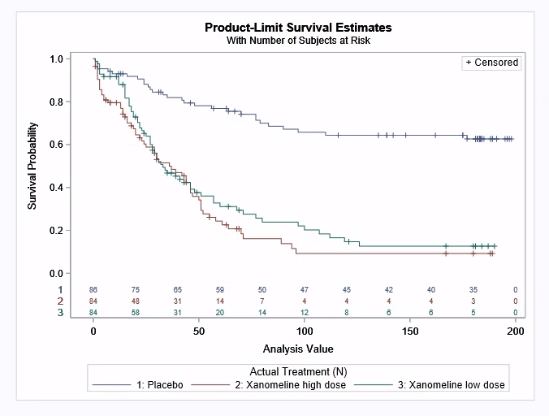

# Did the Alzheimer's patch work, and could patients stay on it? (SAS, CDISC pilot trial)

CDISCPILOT01 is a real 24-week trial, published in anonymised form by CDISC as the standard example for drug
submissions. It tested a xanomeline skin patch for mild-to-moderate Alzheimer's disease in 254 patients, split
into placebo, low dose (54 mg) and high dose (81 mg). This project re-analyses it in SAS from its public ADaM
datasets, the way a submission's tables are made:

- who was in it;
- who finished it;
- did it work (the protocol's primary endpoint);
- was it safe.

Every number is checked twice: once by recomputing it in Python, and once against the R Consortium's published
FDA submission pilot for the same study.

Build log: https://mrrishit909.github.io/projects/clinical-trial-sas/

## Data

The ADaM datasets `ADSL`, `ADQSADAS`, `ADTTE`, `ADAE` and `ADLBC` are SAS transport files from the PhUSE scripts
repository (`data/adam/cdiscpilot01`), pinned to commit `fbd239d`. The SAS program downloads them itself with
`PROC HTTP`. For the Python check, download the same five files into `data/`:

```
for f in adsl adqsadas adtte adae adlbc; do
  curl -sL -o data/$f.xpt https://raw.githubusercontent.com/phuse-org/phuse-scripts/fbd239d9450a99621f0199323d7abf3ae22036db/data/adam/cdiscpilot01/$f.xpt
done
./venv/bin/python parse_log.py sas/01_pilot.log
./venv/bin/python check.py
```

The references are the R Consortium's
[submissions-pilot1](https://github.com/RConsortium/submissions-pilot1/tree/main/output) outputs:
`tlf-demographic.out`, `tlf-primary.rtf`, `tlf-efficacy.rtf` and `tlf-kmplot.pdf`.

## How it was run

`sas/01_pilot.sas` ran in **SAS Enterprise Guide (SAS 9.4M9, Windows)** on USF's virtual desktop, pulled from this
repository at a pinned commit. The log is `sas/01_pilot.log`: 0 errors and 0 warnings. The Windows user name in
temporary paths is replaced by `<user>`.

Every result is written to the log as a `CSV|` line (233 of them). `parse_log.py` turns those lines into
`results/*.csv`, taking the column names from the `%csv` calls in the SAS program itself.

Getting to a clean log took two fixes, each one a commit:
- a fileref and a libref were longer than SAS's 8-character limit (`f_adqsadas`);
- `ods graphics on` was missing, so LIFETEST couldn't draw the at-risk table.

The `%csv` macro writes its separators explicitly from the start, because `CATX` silently drops blank values.

## Steps

1. **Read the ADaM files** with `PROC HTTP` and an `XPORT` libname. Reuse one short fileref and one short libref.
2. **Who was in it:** `PROC MEANS` and `PROC FREQ` on the intent-to-treat population.
3. **Who finished:** the reason for leaving, by arm, and Fisher's exact test of stopping for an adverse event.
4. **Did it work:** ADAS-Cog(11) change from baseline to week 24, carrying the last observation forward (LOCF), in
   the efficacy population. `PROC GLM` ANCOVA with site group and baseline score. It runs twice: once with dose as a
   number (the dose-response test), and once with treatment as a factor, for LS means and pairwise `ESTIMATE`s.
5. **Was it safe:** time to the first dermatologic event (`PROC LIFETEST` with log-rank, and numbers at risk every
   20 days; `PROC PHREG` hazard ratios); adverse events that started on treatment (`PROC SQL`); and a glucose ANCOVA
   at week 20.
6. **Charts:** `PROC LIFETEST` and `PROC SGPLOT` (screenshots of Enterprise Guide's results).
7. **Check:** `check.py` recomputes all 399 SAS numbers with pandas, statsmodels and scipy:
   - statistics and least-squares results to 1e-6;
   - the Cox model to 1e-4.

   It then compares every figure the R Consortium published.

## Results

**It didn't work.** ADAS-Cog goes up as cognition gets worse, and patients in all three arms declined over 24 weeks.

| Week 24, LOCF | Placebo | Low dose | High dose |
|---|---|---|---|
| Patients | 79 | 81 | 74 |
| Mean change (SD) | 2.5 (5.80) | 2.0 (5.55) | 1.5 (4.26) |
| LS mean change | 2.47 | 2.01 | 1.47 |
| vs placebo (95% CI) | | −0.5 (−2.1 to 1.1), p = 0.569 | −1.0 (−2.7 to 0.7), p = 0.233 |

The dose-response test gives p = 0.245. Every one of these matches the R Consortium's Table 14-3.01.



**Patients couldn't stay on it.**

| | Placebo | Low dose | High dose |
|---|---|---|---|
| Completed the study | 58/86 (67%) | 25/84 (30%) | 27/84 (32%) |
| Stopped because of an adverse event | 8/86 (9%) | 44/84 (52%) | 40/84 (48%) |
| Any dermatologic event | 29/86 (34%) | 62/84 (74%) | 61/84 (73%) |
| Application-site pruritus | 6 | 22 | 22 |
| Application-site erythema | <5 | 12 | 15 |

Fisher's exact test of stopping for an adverse event across arms: p = 9.4 × 10⁻¹¹.



**Skin reactions came fast.** Half the patients on the patch had their first dermatologic event by day 33 (low dose)
or day 36 (high dose). On placebo, the Kaplan-Meier curve never falls below 62%, so there is no median. Compared with placebo, the hazard ratio is 4.1
(2.6–6.5) for low dose and 5.0 (3.2–7.9) for high dose. The log-rank χ² is 60.3 on 2 df (p = 8 × 10⁻¹⁴). The
numbers at risk every 20 days match the R Consortium's KM plot exactly, for all 33 points. The plot's x-axis is
days since the first dose.



**Glucose:** at week 20 the high dose differs from placebo by 0.07 mmol/L (95% CI −0.51 to 0.64, p = 0.822). The
estimate and p-value match the R Consortium. Their interval, (−0.50, 0.63), and their RMSE, 1.30 against SAS's 1.32,
differ slightly. Recomputing shows why: they used a normal quantile instead of t, and divided the residual sum of
squares by n instead of n − 3.

## What this does not show

- This is the CDISC pilot's anonymised and modified version of the trial, not the original clinical database.
  It's the standard teaching and test dataset, so the findings describe this dataset, not a regulatory decision.
- LOCF assumes a patient who dropped out would have stayed where they were. With half the patients on the drug
  leaving early, that assumption carries a lot of weight.
- No multiplicity adjustment, as in the original table.
- The adverse-event counts include every event that started on treatment, at any severity and whatever its relation
  to the drug.
- Charts are screenshots of the SAS output in Enterprise Guide.
